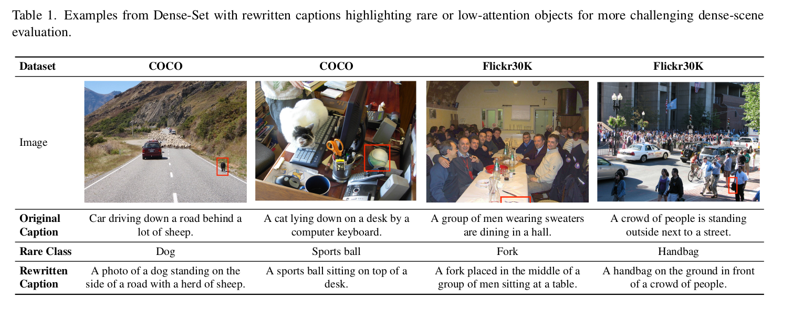

<div align="center">

# LARE: Low-Attention Region Encoding for Text–Image Retrieval

**[CVPR 2026 — MULA Workshop](https://mula-workshop.github.io/)** | [Project Page](https://falmeshal.github.io/LARE/) | [Dense-Set Dataset](https://huggingface.co/datasets/AbdulmalekDS/Dense-Set)

**LARE** is a training-free augmentation for text-to-image retrieval in crowded scenes. Our method mines low-attention regions from a frozen vision encoder, encodes these regions alongside the full image, and combines regional embeddings with the global image embedding at inference time. This simple test-time procedure improves retrieval on Dense-Set variants that emphasize subtle and occluded content.

<br>

<br>


</div>

## Quick Start

```bash
conda env create -f environment.yml
conda activate lare
```

```python
from lare import create_lare

pipeline = create_lare(model="siglip-so400m")
score = pipeline.retrieve(image, "a person carrying a red bag")
print(score.score)
```

## Reproduce Results

> **Hardware**: All benchmarks were evaluated on two NVIDIA Quadro RTX 8000 GPUs. However, a standard 11GB-16GB GPU is sufficient to reproduce the results.

1. Download images required in [`data/README.md`](data/README.md).
2. Benchmark results are available in [`RESULTS.md`](RESULTS.md).

Run standard benchmark evaluations:

```bash
COCO_DIR=/path/to/coco/val2014 \
FLICKR_DIR=/path/to/flickr30k-images \
bash scripts/reproduce.sh
```

## Citation

```bibtex
@inproceedings{alquwayfili2026lare,
  title={LARE: Low-Attention Region Encoding for Text--Image Retrieval},
  author={Abdulmalik Alquwayfili and Faisal Almeshal and Jumanah Almajnouni
          and Leena Alotaibi and Huda Alamri and Muhammad Kamran J Khan},
  booktitle={Proceedings of the IEEE/CVF Conference on Computer Vision and
             Pattern Recognition Workshops (CVPRW)},
  year={2026}
}
```
